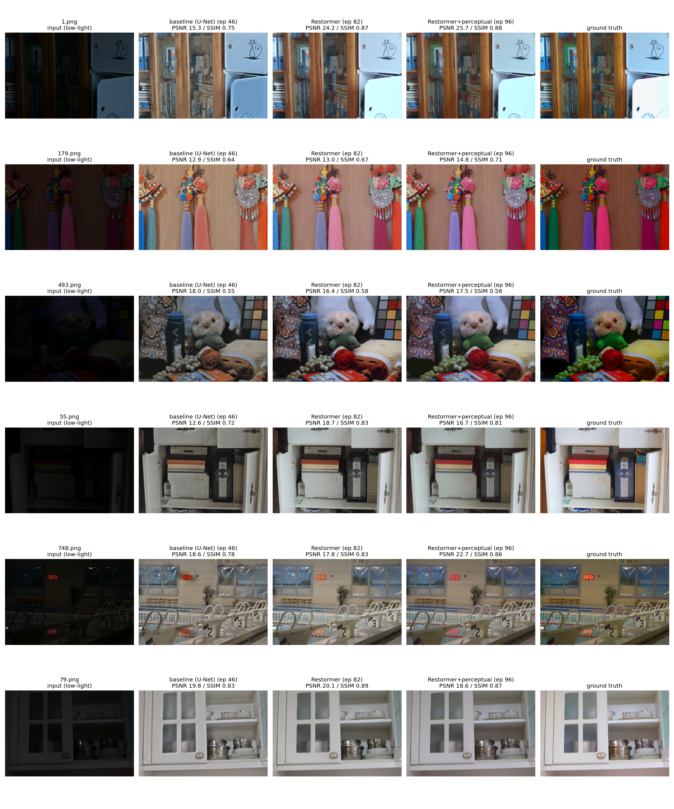

# Low-Light Image Enhancement

A transformer-based low-light image enhancement pipeline, built end-to-end from raw data to a live cloud inference endpoint — data pipeline, baseline, transformer backbone, perceptual loss, no-reference quality evaluation, ONNX edge export, and a benchmarked Cloud Run deployment.

Built as a portfolio project targeting Applied Scientist / ML Engineer roles in computer vision, with an emphasis on industrial-inspection-style rigor: every architectural and deployment decision below is backed by a measured result, not an assumption — including the two places where a plausible-looking result turned out to be noise (see [Lessons Learned](#lessons-learned)).


*Six `eval15` test images, all four pipeline stages. Row 3 (`493.png`) is a documented edge case: it's the one near-black frame where the baseline (18.0 dB) actually beats both transformer models (16.4 / 17.5 dB) — see [Results](#results) for why.*

## Results

Evaluated on the LOL dataset's `eval15` held-out test set (15 images, native 400×600 resolution).

| Model | PSNR (dB) ↑ | SSIM ↑ | LPIPS ↓ | MANIQA ↑ |
|---|---|---|---|---|
| Input (low-light) | 7.77 | 0.196 | 0.560 | 0.298 |
| U-Net baseline | 18.28 | 0.738 | 0.333 | 0.200 |
| Restormer | 20.05 | 0.796 | 0.203 | 0.268 |
| **Restormer + DINOv2 perceptual loss** | **21.33** | **0.800** | **0.186** | 0.293 |
| Ground truth | — | — | — | 0.587 |

The final model improves **+13.6 dB PSNR** and **+0.60 SSIM** over the raw input, and **+1.28 dB PSNR** over the transformer backbone alone by adding a perceptual loss term.

Two MANIQA results need context, not a single caveat, because they have different causes:
- **All three trained models score below the raw input on MANIQA.** This is a domain-shift artifact: MANIQA's training distribution (KonIQ-10k) contains no near-black frames, so it has no reliable basis for judging those images as real photos. One eval image (`493.png`) even reverses the usual PSNR ranking for the same reason.
- **The U-Net baseline scores lowest of all four (0.200, below even the raw input).** This one is a real, correct quality judgment — the baseline's output has a visible haze and cyan-blue color cast that MANIQA is known to penalize regardless of training distribution.

## Architecture

**Backbone:** [Restormer](https://arxiv.org/abs/2111.09881)-style transformer (own implementation, not a ported codebase), chosen over SwinIR specifically for VRAM reasons — Restormer's MDTA (Multi-DConv Head Transposed Attention) computes attention *across channels* rather than across pixels, so its cost is independent of image resolution. That matters on a 4GB, non-Tensor-Core GTX 1650.

Scaled down from the paper's reference config to fit the training budget:

| | Reference Restormer | This project |
|---|---|---|
| `dim` | 48 | 24 |
| `num_blocks` | [4,6,6,8] | [2,3,3,4] |
| `num_refinement_blocks` | 4 | 2 |
| `ffn_expansion_factor` | 2.66 | 2.0 |
| Parameters | ~26M | 3.27M |

**Loss:** Charbonnier (smooth L1) + SSIM (`ssim_weight=0.2`) + a frozen DINOv2 (`dinov2_vits14`) perceptual term over patch-token embeddings (`perceptual_weight=0.05`). The perceptual weight was retuned down from an initial 0.1 after checking *raw* per-term loss magnitudes — DINOv2's term was ~4× SSIM's at init, so 0.1 let it dominate the gradient rather than complement it.

**Output formulation:** the network predicts a residual added to the input (`x + residual`), left unclamped inside `forward()` — clamping there kills gradients on out-of-range pixels at initialization.

**Divisibility constraint:** H, W must be divisible by 8 (three 2× downsamples). Handled transparently at inference time by a reflect-pad → model → crop wrapper baked into the exported ONNX graph, so no caller needs to know about it.

## Pipeline

| Phase | What | Status |
|---|---|---|
| 0 | Environment (WSL2, CUDA, GTX 1650) | ✅ |
| 1 | LOL dataset loader, paired augmentation | ✅ |
| 2 | U-Net baseline | ✅ |
| 3 | Restormer backbone | ✅ |
| 4 | DINOv2 perceptual loss | ✅ |
| 5 | No-reference quality metric (MANIQA) | ✅ |
| 6 | Full PSNR/SSIM/LPIPS/MANIQA benchmark | ✅ |
| 7 | ONNX export, quantization attempt, latency/size benchmark | ✅ |
| 8 | FastAPI + Docker + GCP Cloud Run | ✅ |
| 9 | Documentation & polish | ✅ |

## Edge Deployment (Phase 7)

Exported to ONNX (opset 17, dynamic batch/H/W axes) for a runtime-portable inference artifact.

| Artifact | Size |
|---|---|
| PyTorch checkpoint (training) | 37.68 MB |
| ONNX fp32 (inference) | 13.29 MB |
| ONNX INT8 | not viable (see below) |

The 3× size drop isn't model compression — it's AdamW's `exp_avg`/`exp_avg_sq` momentum buffers (2× the parameter count) plus optimizer/epoch metadata, stripped away because ONNX is inference-only.

**INT8 dynamic quantization doesn't work for this architecture.** Restormer is entirely `Conv2d`, much of it grouped/depthwise (MDTA's `qkv_dwconv`, GDFN's `dwconv`). ONNX Runtime's CPU `ConvInteger` kernel doesn't support several of those configurations — it loads and fails only at `InferenceSession` creation, not at quantization time. A `MatMul`-only fallback technically "succeeds" but quantizes nothing real (0.000 numerical diff, and a *larger* file); the export script explicitly checks for and rejects this false positive. `torch.ao.quantization` with the `qnnpack` backend — purpose-built for grouped/depthwise convs — is the untried path for a future project.

| Runtime | Latency @ 400×600, batch=1 |
|---|---|
| PyTorch CPU | 2473 ± 147 ms |
| PyTorch CUDA | 284 ± 0.3 ms |
| ONNX Runtime CPU fp32 | 3027 ± 21 ms |
| ONNX Runtime CUDA fp32 | 581 ± 1.8 ms |

ONNX Runtime CPU is ~18% slower than PyTorch CPU here — plausibly PyTorch's backend being better tuned for this dwconv-heavy op mix (the same op class that breaks INT8), not root-caused further.

## Cloud Deployment (Phase 8)

Two identical FastAPI backends (`/health`, `/enhance`) were built and benchmarked side by side before picking one:

| | ONNX Runtime CPU | PyTorch CPU |
|---|---|---|
| Image size | **131.9 MB** | 319.4 MB |
| Cold start | **2.03 s** | 2.29 s |
| Server inference | 3000 ms | **2781 ms** |
| Quality (PSNR/SSIM) | 25.64 / 0.88 | 25.64 / 0.88 |

**ONNX selected** — a 2.4× smaller, torch-free image was judged worth more than PyTorch's ~7% latency edge, for a scale-to-zero target where cold start and image pull dominate cost more than a few hundred ms per request.

Deployed to Cloud Run (`us-central1`, `--cpu=4 --memory=2Gi`). A repeated-sampling benchmark (n=10) against the live endpoint gives the real production numbers:

| | Mean | Std | Range |
|---|---|---|---|
| Server inference | 3846.7 ms | 298.3 ms | 3369.6 – 4523.7 ms |

Quality never moved across any config or test: **PSNR 25.64 / SSIM 0.880**, every run.

## Lessons Learned

The project's operating principle throughout: every decision is backed by a measured result, and single-sample comparisons don't count as evidence. Two examples where that discipline caught a real mistake mid-project:

1. **Chasing a Cloud Run "CPU bottleneck" that was actually noise.** A `--cpu=2` deploy showed two slow single-sample reads, which looked like a CPU cap problem, so the config was bumped to `--cpu=4`, then further tuned with `ORT_INTRA_OP_THREADS=2`. Each change was judged off one more single sample — until an actual n=10 benchmark against the live service showed the `-cpu=4` config's own std (298 ms) fully contains the original `--cpu=2` single-sample reads. The entire tuning sequence was likely never distinguishable from request-to-request variance. Kept the final config on "no evidence it's wrong," not "proven better," and documented the methodology gap rather than the false conclusion.
2. **An ONNX backend recommendation reversed after being challenged to show the data.** An early size comparison was going to decide the serving backend before it had actually been measured — corrected mid-project by running the real side-by-side container benchmark first.

## Repository Structure

```
src/
  data/
    lol_dataset.py       # LOLDataset, make_splits()
    transforms.py        # PairedTransform, synthetic_low_light_degrade()
  models/
    unet.py               # U-Net baseline (Phase 2)
    restormer.py           # Restormer backbone (Phase 3)
  losses.py                # CharbonnierLoss, ReconstructionLoss
  perceptual_loss.py        # DINOv2PerceptualLoss (Phase 4)
  metrics.py                # PSNR / SSIM (kornia wrappers)
  quality_metrics.py         # MANIQA no-reference IQA (Phase 5)
  lpips_metric.py            # LPIPS wrapper (Phase 6)
  onnx_export.py              # DeployRestormer wrapper, export_onnx, quantize_dynamic_int8
  serve_onnx.py                # FastAPI + ONNX Runtime CPU serving backend
  serve_pytorch.py              # FastAPI + PyTorch CPU serving backend
  train_baseline.py            # Phase 2 training loop
  train_restormer.py            # Phase 3 training loop
  train_phase4.py                # Phase 4 training loop (perceptual loss)

scripts/
  verify_phase{1-8}.py          # Smoke tests, one per phase
  benchmark_phase{6,7,8}.py     # Metric / latency / size benchmarks
  benchmark_cloud_run.py        # Repeated-sampling benchmark against a live URL
  visualize_predictions*.py     # Qualitative before/after grids
  export_for_serving_{onnx,pytorch}.py
  deploy_phase8.sh              # Build → push → gcloud run deploy

low-light-enhancement-project-plan.md   # Full phase-by-phase decision log
```

## Getting Started

### Prerequisites
- NVIDIA driver 470.76+ for WSL2 CUDA passthrough (this project used the Studio driver, 610.57.01 — see Phase 0 log). **No system CUDA Toolkit install is required** — `nvcc` isn't present in this project's environment at all, and both `torch==2.5.1+cu121` and `onnxruntime-gpu` still expose `CUDAExecutionProvider` (verified via `python -c "import onnxruntime as ort; print(ort.get_available_providers())"`), because both ship their own CUDA runtime as pip packages (`nvidia-cublas-cu12`, `nvidia-cudnn-cu12`, etc.).

### Setup
```bash
python -m venv venv && source venv/bin/activate
pip install -r requirements.txt
kaggle datasets download -d soumikrakshit/lol-dataset -p data/ --unzip
```

### Train
```bash
python src/train_phase4.py \
    --crop-size 128 --batch-size 2 --accum-steps 2 \
    --ssim-weight 0.2 --perceptual-weight 0.05 --epochs 100
```

### Evaluate
```bash
python scripts/benchmark_phase6.py   # full PSNR/SSIM/LPIPS/MANIQA table
python scripts/visualize_predictions_phase6.py   # before/after grid
```

### Export & serve locally
```bash
python scripts/export_for_serving_onnx.py
docker build -f Dockerfile.onnx -t low-light-enhancement:onnx .
docker run -p 8080:8080 low-light-enhancement:onnx
python scripts/verify_phase8.py --url http://localhost:8080 \
    --low-image data/LOLdataset/eval15/low/1.png \
    --high-image data/LOLdataset/eval15/high/1.png
```

### Deploy to Cloud Run
```bash
PROJECT_ID=your-gcp-project ./scripts/deploy_phase8.sh
```

## Limitations & Future Work

- **INT8 quantization:** ONNX-side dynamic quantization isn't viable for Restormer's grouped/depthwise convs (see above). `torch.ao.quantization` with the `qnnpack` backend is the untried, architecture-appropriate path — planned as a separate follow-up project. GPU INT8 was also never benchmarked, originally noted as blocked on TensorRT — `TensorrtExecutionProvider` is confirmed present in this environment's ONNX Runtime install, so that path is actually unblocked, just not yet attempted.
- **C++/OpenCV DNN deployment:** a planned follow-up for tiled inference via OpenCV's DNN module, which has narrower ONNX op coverage than ONNX Runtime — needs an operator-compatibility smoke test before porting.
- **LR schedule:** trained with a flat `lr=2e-4` throughout; late-epoch PSNR oscillation suggests a cosine or plateau schedule could recover a small additional gain, not pursued given the model already cleared the baseline by a wide margin.
- **Single-image latency comparisons:** Phase 7/8 latency benchmarks used one representative image rather than an eval15-wide aggregate.
- **Cloud vs. local inference gap:** the live endpoint runs ~28% slower than the local container benchmark, plausibly virtualization/scheduling overhead — not root-caused.
- **No interactive demo (Gradio/Streamlit):** scoped in Phase 9 as optional, deliberately deferred — the before/after grid above and the deployed Cloud Run endpoint already cover the two things a demo would add (visual proof and a live callable service), so it wasn't judged worth the added maintenance surface for this MVP. Would revisit if a reviewer without API/curl familiarity needed a no-setup way to try it.

## Tech Stack

PyTorch · ONNX Runtime · Kornia · DINOv2 (`torch.hub`) · LPIPS · pyiqa (MANIQA) · FastAPI · Docker · Google Cloud Run

## Author

Paulo Salvador Britto Nigro — PhD, Computational Mechanics. Built independently of employer work: own architecture, own public dataset (LOL), own code.
